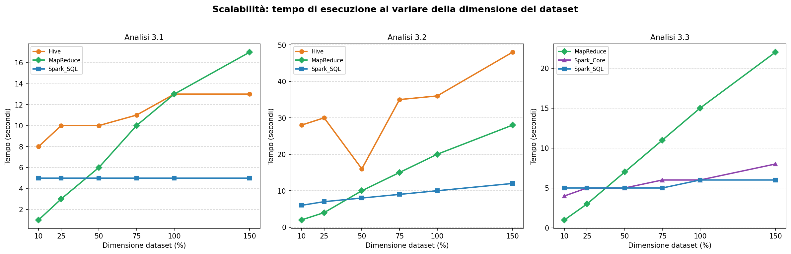
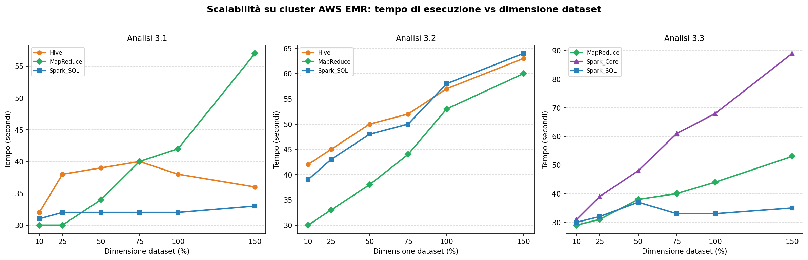
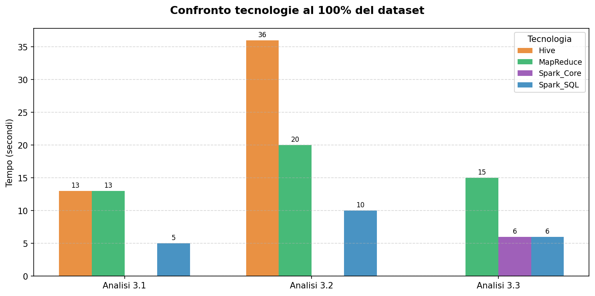
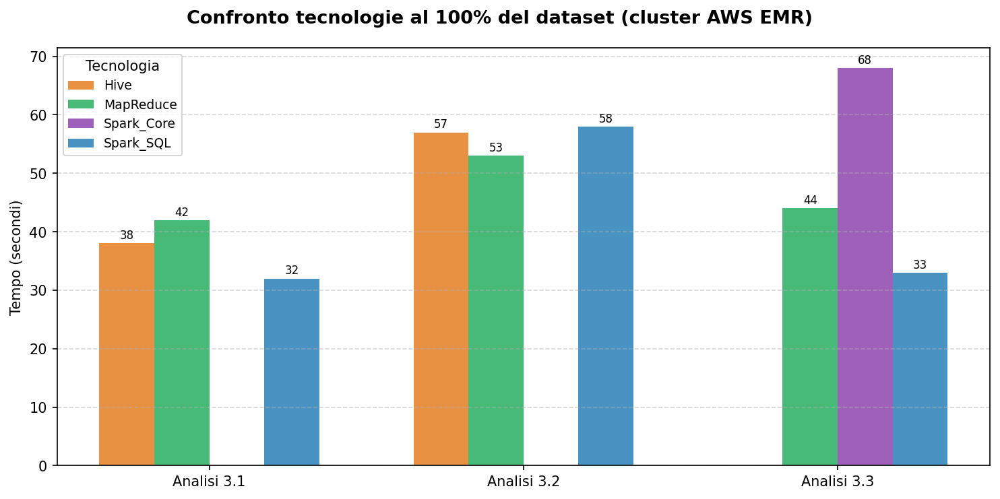
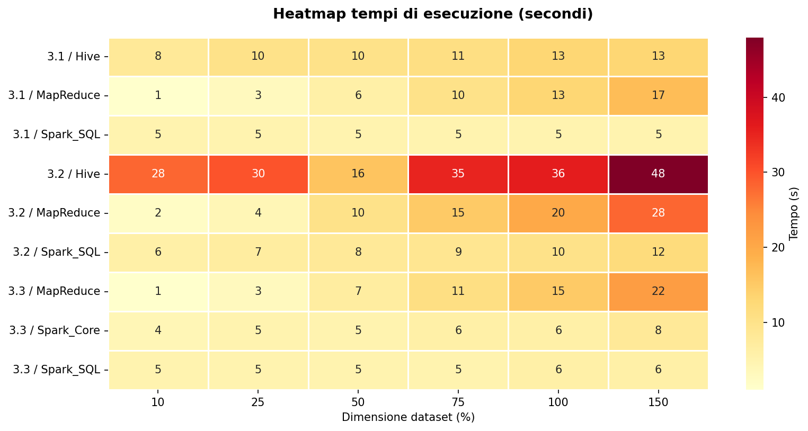
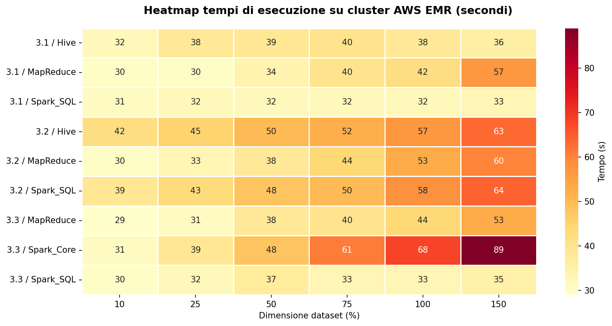

# Flight Delay 2024 — Analisi comparativa Big Data

**Università degli Studi Roma Tre — Corso di Big Data**
**Docente: Prof. Riccardo Torlone — Consegna: 04/06/2026**

Autore: Camilla Maria Santoro

Specifica del progetto: [Secondo progetto.pdf](Secondo%20progetto.pdf)

---

## Indice

1. [Oggetto del progetto](#1-oggetto-del-progetto)
2. [Dataset](#2-dataset)
3. [Preparazione dei dati](#3-preparazione-dei-dati)
4. [Analisi implementate](#4-analisi-implementate)
5. [Tecnologie utilizzate](#5-tecnologie-utilizzate)
6. [Struttura del repository](#6-struttura-del-repository)
7. [Esecuzione in locale](#7-esecuzione-in-locale)
8. [Esecuzione su cluster AWS EMR](#8-esecuzione-su-cluster-aws-emr)
9. [Risultati](#9-risultati)
10. [Benchmark e scalabilità](#10-benchmark-e-scalabilità)
11. [Confronto locale vs cluster](#11-confronto-locale-vs-cluster)
12. [Note implementative](#12-note-implementative)
13. [Conformità alla traccia](#13-conformità-alla-traccia)

---

## 1. Oggetto del progetto

Il progetto sperimenta l'uso comparativo di diverse tecnologie Big Data per l'analisi di un dataset reale di voli aerei (Flight Delay 2024, oltre 7 milioni di record). Per ciascuna delle tre analisi richieste dalla traccia (§3 PDF) è stata realizzata un'implementazione in **tre tecnologie diverse**, eseguita sia in **ambiente locale** (macOS) che su **cluster AWS EMR** distribuito.

Gli aspetti affrontati sono: (i) progettazione delle elaborazioni, (ii) preparazione e pulizia dei dati, (iii) confronto tra tecnologie eterogenee, (iv) efficienza e scalabilità delle soluzioni al variare della dimensione dell'input.

---

## 2. Dataset

- **Fonte**: [Flight Data 2024 — Kaggle](https://www.kaggle.com/datasets/hrishitpatil/flight-data-2024)
- **Dimensione raw**: ~1.3 GB, ~7.000.000 record, 35 colonne
- **Formato**: CSV
- **Periodo coperto**: anno solare 2024
- **Schema rilevante** (colonne usate dalle analisi):

| Colonna | Tipo | Descrizione |
|---|---|---|
| `month` | int | Mese del volo (1–12) |
| `op_unique_carrier` | string | Codice IATA della compagnia |
| `origin` | string | Aeroporto di partenza |
| `dep_delay` | float | Ritardo in partenza (minuti) |
| `arr_delay` | float | Ritardo in arrivo (minuti) |
| `cancelled` | int | 1 se volo cancellato, 0 altrimenti |
| `cancellation_code` | string | A/B/C/D (causa cancellazione) |
| `carrier_delay`, `weather_delay`, `nas_delay`, `security_delay`, `late_aircraft_delay` | float | Cause del ritardo in minuti |

Il file raw va posizionato in [data/raw/flight_data_2024.csv](data/raw/) prima della preparazione (è già escluso da `.gitignore` per via della dimensione; va scaricato da Kaggle).

---

## 3. Preparazione dei dati

La fase di preparazione è documentata nel notebook [data_preparation.ipynb](data_preparation.ipynb) ed esegue, in ordine:

1. **Caricamento** di `data/raw/flight_data_2024.csv`.
2. **Eliminazione record non significativi**: voli deviati (`diverted == 1`), record con timestamp incompleti, righe duplicate.
3. **Normalizzazione**: tipi numerici, codici aeroporto/compagnia in maiuscolo, codici causa-cancellazione mappati a `A/B/C/D`.
4. **Selezione colonne**: vengono mantenute solo le 15 colonne rilevanti per le analisi (vedi §2).
5. **Trasformazione attributi temporali**: estrazione del mese.
6. **Generazione di 6 dataset crescenti** (richiesta del §6 PDF per studi di scalabilità):

| Dataset | % rispetto al pulito | Strategia |
|---|---|---|
| `dataset_10.csv` | 10% | Campionamento casuale stratificato |
| `dataset_25.csv` | 25% | Campionamento casuale stratificato |
| `dataset_50.csv` | 50% | Campionamento casuale stratificato |
| `dataset_75.csv` | 75% | Campionamento casuale stratificato |
| `dataset_100.csv` | 100% | Tutto il dataset pulito (~6.87M record) |
| `dataset_150.csv` | 150% | Concatenazione di 100% + 50% (replica controllata) |

I dataset sono salvati in [data/cleaned/](data/cleaned/) e sono l'input di tutti gli script di esecuzione.

---

## 4. Analisi implementate

### 4.1 Statistiche delle compagnie aeree (§3.1 PDF)

Per ogni compagnia aerea, per ciascun aeroporto di partenza e per ciascun mese:
- numero di voli operati,
- ritardo minimo, massimo e medio in arrivo,
- tasso di cancellazione (%),
- elenco dei mesi in cui la compagnia opera in quell'aeroporto.

**Output**: `codice, aeroporto_partenza, numero_voli, ritardo_minimo, ritardo_massimo, ritardo_medio, tasso_cancellazione, mese` — 18.683 righe sul 100%.

### 4.2 Report dei ritardi per aeroporto e periodo (§3.2 PDF)

Per ciascun aeroporto di partenza e per ciascun mese:
- numero di voli in 3 fasce di ritardo in partenza: **basso** (<15 min), **medio** (15–60 min), **alto** (>60 min),
- per ogni fascia, ritardo medio in partenza e in arrivo,
- le tre cause di ritardo o cancellazione più frequenti.

**Output**: `aeroporto_partenza, mese, numero_ritardi_basso, dep_avg_basso, arr_avg_basso, numero_ritardi_medio, dep_avg_medio, arr_avg_medio, numero_ritardo_alto, dep_avg_alto, arr_avg_alto, cause_maggiori` — 4.039 righe sul 100%.

### 4.3 Ranking compagnia-aeroporto con comportamento anomalo (§3.3 PDF)

Per ciascuna coppia `(aeroporto, compagnia)`:
- numero di voli operati,
- ritardo medio in partenza e in arrivo,
- tasso di cancellazione,
- **differenza** tra il ritardo medio in partenza della compagnia e quello medio dell'aeroporto,
- **classifica** della compagnia in quell'aeroporto, dalla migliore (rank 1, ritardo medio in partenza più basso) alla peggiore.

**Output**: `aeroporto_partenza, compagnia, numero_voli, ritardo_medio_partenza, ritardo_medio_arrivo, tasso_cancellazione, differenza, classifica` — 1.738 righe sul 100%.

---

## 5. Tecnologie utilizzate

La traccia richiede almeno 2 analisi con almeno 3 tecnologie. Il progetto realizza **tutte e 3 le analisi** con **3 tecnologie ciascuna** (totale 9 implementazioni indipendenti):

| Analisi | MapReduce | Hive | Spark SQL | Spark Core |
|---|:-:|:-:|:-:|:-:|
| 3.1 | ✓ | ✓ | ✓ | — |
| 3.2 | ✓ | ✓ | ✓ | — |
| 3.3 | ✓ | — | ✓ | ✓ |

### MapReduce (Hadoop Streaming in Python)

Implementazione esplicita di mapper e reducer come script Python; viene eseguita tramite Hadoop Streaming. Permette controllo fine della logica di aggregazione ma richiede più codice rispetto agli approcci dichiarativi.

| Analisi | Mapper | Reducer |
|---|---|---|
| 3.1 | [analysis_31/mapreduce/mapper.py](analysis_31/mapreduce/mapper.py) | [analysis_31/mapreduce/reducer.py](analysis_31/mapreduce/reducer.py) |
| 3.2 | [analysis_32/mapreduce/mapper_3_2.py](analysis_32/mapreduce/mapper_3_2.py) | [analysis_32/mapreduce/reducer_3_2.py](analysis_32/mapreduce/reducer_3_2.py) |
| 3.3 | [analysis_33/mapreduce/mapper_3_3.py](analysis_33/mapreduce/mapper_3_3.py) | [analysis_33/mapreduce/reducer_3_3.py](analysis_33/mapreduce/reducer_3_3.py) |

### Hive (HQL su HDFS)

SQL declarativo eseguito su Hive (motore MapReduce sottostante in locale, su YARN nel cluster). Massima espressività SQL ma overhead di startup elevato.

| Analisi | Setup tabella | Query |
|---|---|---|
| 3.1 | [analysis_31/hive/setup_table.sql](analysis_31/hive/setup_table.sql) | [analysis_31/hive/hive_3_1.sql](analysis_31/hive/hive_3_1.sql) |
| 3.2 | [analysis_32/hive/setup_table.sql](analysis_32/hive/setup_table.sql) | [analysis_32/hive/hive_3_2.sql](analysis_32/hive/hive_3_2.sql) |

### Spark SQL

Stesse query in dialetto Spark SQL, eseguite dal motore Catalyst di Spark. Pipeline ottimizzata in-memory, generalmente la tecnologia più rapida fra quelle testate.

| Analisi | Setup tabella | Query |
|---|---|---|
| 3.1 | [analysis_31/spark_sql/setup_table.sql](analysis_31/spark_sql/setup_table.sql) | [analysis_31/spark_sql/spark_sql_3_1.sql](analysis_31/spark_sql/spark_sql_3_1.sql) |
| 3.2 | [analysis_32/spark_sql/setup_table.sql](analysis_32/spark_sql/setup_table.sql) | [analysis_32/spark_sql/spark_sql_3_2.sql](analysis_32/spark_sql/spark_sql_3_2.sql) |
| 3.3 | [analysis_33/spark_sql/setup_table.sql](analysis_33/spark_sql/setup_table.sql) | [analysis_33/spark_sql/spark_sql_3_3.sql](analysis_33/spark_sql/spark_sql_3_3.sql) |

### Spark Core (RDD API in PySpark)

API a basso livello di Spark basata su RDD, scelta per l'analisi 3.3 perché il calcolo della classifica e della differenza vs media aeroporto si esprime naturalmente con `groupByKey` + `mapValues` + `join`.

Implementazione: [analysis_33/spark_core/spark_core_3_3_.py](analysis_33/spark_core/spark_core_3_3_.py).

---

## 6. Struttura del repository

```
flight-delay-bigdata1/
├── README.md                     ← questo file
├── Secondo progetto.pdf          ← traccia ufficiale
├── data_preparation.ipynb        ← notebook di pulizia e generazione dataset
├── run_all_analyses.sh           ← esecuzione completa in locale (9 job × 6 percentuali)
├── test_singolo.sh               ← test rapido di un singolo job sul 10%
│
├── data/
│   ├── raw/                      ← flight_data_2024.csv (da Kaggle, gitignored)
│   └── cleaned/                  ← dataset_{10,25,50,75,100,150}.csv
│
├── analysis_31/                  ← 3.1 — statistiche compagnie
│   ├── hive/                     ← setup_table.sql + hive_3_1.sql
│   ├── mapreduce/                ← mapper.py + reducer.py
│   └── spark_sql/                ← setup_table.sql + spark_sql_3_1.sql
│
├── analysis_32/                  ← 3.2 — report fasce di ritardo
│   ├── hive/
│   ├── mapreduce/
│   └── spark_sql/
│
├── analysis_33/                  ← 3.3 — ranking anomalie
│   ├── mapreduce/
│   ├── spark_core/               ← spark_core_3_3_.py
│   └── spark_sql/
│
├── cluster/                      ← esecuzione su AWS EMR
│   ├── cluster_setup.md          ← guida step-by-step setup AWS Academy
│   ├── upload_to_s3.sh           ← upload dati+codice su bucket S3
│   ├── run_cluster.sh            ← script eseguito sul master EMR
│   └── download_results.sh       ← scarica risultati S3 → locale
│
├── benchmarks/                   ← benchmark locale
│   ├── benchmarks.csv            ← tempi per (percentuale, analisi, tecnologia)
│   ├── generate_charts.py        ← script generazione grafici
│   └── charts/                   ← grafici PNG
│
├── benchmarks_cluster/           ← benchmark cluster (stesso schema)
│   ├── benchmarks_cluster.csv
│   ├── generate_charts_cluster.py
│   └── charts_cluster/
│
├── comparisons/                  ← confronto locale vs cluster
│   ├── confronto_locale_cluster.ipynb
│   └── charts/                   ← grafici di confronto
│
├── results/                      ← output locale al 100%
│   ├── analysis_31/{hive,mapreduce,spark_sql}/
│   ├── analysis_32/{hive,mapreduce,spark_sql}/
│   └── analysis_33/{mapreduce,spark_core,spark_sql}/
│       ↳ in ciascuna: full_results.csv + top_10results.csv
│
└── results_cluster/              ← output cluster al 100% (stessa struttura)
```

---

## 7. Esecuzione in locale

### Prerequisiti

| Componente | Versione testata | Note |
|---|---|---|
| Hadoop | 3.4.1 | Standalone mode |
| Hive | 2.3.9 | Metastore embedded Derby |
| Spark | 3.5.8 (`bin-hadoop3`) | |
| Python | 3.10 o 3.11 | con `pandas`, `pyspark`. PySpark 3.5.8 non è compatibile con Python 3.13+ (bug `cloudpickle`); `run_all_analyses.sh` imposta `PYSPARK_PYTHON=/opt/homebrew/opt/python@3.11/bin/python3.11` |
| Java | OpenJDK 11 | Homebrew |

Le variabili d'ambiente (`HADOOP_HOME`, `HIVE_HOME`, `SPARK_HOME`) vengono impostate dagli script stessi; modificare i path all'inizio di [run_all_analyses.sh](run_all_analyses.sh) e [test_singolo.sh](test_singolo.sh) per riflettere l'installazione locale.

### Comando one-shot (tutte le analisi su tutti i dataset)

```bash
bash run_all_analyses.sh
```

Esegue 9 job × 6 percentuali = **54 esecuzioni**. Tempo totale tipico: 20–40 minuti su MacBook Pro M-series. Produce:

- [results/](results/) — output del 100% (full + top 10) per le 9 implementazioni
- [benchmarks/benchmarks.csv](benchmarks/benchmarks.csv) — tabella `(percentuale, analisi, tecnologia, tempo_secondi)`

### Smoke test rapido (un solo job al 10%)

```bash
bash test_singolo.sh
```

Esegue Hive 3.1 sul dataset al 10%, ~10 secondi. Utile per verificare la configurazione dell'ambiente prima del run completo.

### Grafici dei benchmark

```bash
python3 benchmarks/generate_charts.py
```

Salva i grafici in [benchmarks/charts/](benchmarks/charts/).

---

## 8. Esecuzione su cluster AWS EMR

L'intera procedura è documentata in dettaglio in [cluster/cluster_setup.md](cluster/cluster_setup.md). Sintesi:

### Architettura

| Risorsa | Configurazione |
|---|---|
| Cluster | AWS EMR `emr-7.8.0` |
| Nodi | 1 master + 2 core (3 totali) |
| Istanze | `m5.xlarge` (4 vCPU, 16 GB RAM) |
| Applicazioni | Hadoop + Hive + Spark |
| Storage | S3 per input/output durevole, HDFS effimero del cluster per intermediate |

### Workflow in 3 step

**1) Upload dati e codice su S3** (dal proprio laptop, una volta sola):

```bash
bash cluster/upload_to_s3.sh <nome-bucket>
```

Carica i 6 CSV puliti + le 3 cartelle `analysis_*/` + lo script `run_cluster.sh` nella struttura S3:

```
s3://<bucket>/data/dataset_{10,25,50,75,100,150}.csv
s3://<bucket>/code/{analysis_31,analysis_32,analysis_33}/...
s3://<bucket>/code/run_cluster.sh
```

**2) Lancio cluster + esecuzione delle analisi**:

```bash
# (dal laptop) creazione cluster
aws emr create-cluster \
  --name flight-delay-cluster \
  --release-label emr-7.8.0 \
  --applications Name=Hadoop Name=Hive Name=Spark \
  --instance-type m5.xlarge --instance-count 3 \
  --use-default-roles \
  --ec2-attributes KeyName=<key-pair> \
  --region us-east-1

# (dopo che lo stato è WAITING) SSH al master
ssh -i ~/<key-pair>.pem hadoop@<master-dns>

# (sul master) sincronizzazione codice ed esecuzione
aws s3 cp s3://<bucket>/code/run_cluster.sh .
S3_BUCKET=<bucket> bash run_cluster.sh
exit
```

`run_cluster.sh` copia i dataset da S3 a HDFS, esegue tutti i 54 job (6 percentuali × 9 analisi), salva i risultati del 100% su `s3://<bucket>/results/` e il benchmark complessivo su `s3://<bucket>/benchmarks_cluster.csv`.

**3) Download dei risultati**:

```bash
bash cluster/download_results.sh <nome-bucket>
```

Scarica `s3://<bucket>/results/` → [results_cluster/](results_cluster/) e il CSV benchmark → [benchmarks_cluster/benchmarks_cluster.csv](benchmarks_cluster/benchmarks_cluster.csv).

### Terminazione del cluster

Critico per non consumare crediti AWS Academy:

```bash
aws emr terminate-clusters --cluster-ids <cluster-id>
```

---

## 9. Risultati

I risultati al 100% sono organizzati per analisi e per tecnologia. Per ciascuna implementazione vengono salvati due file:

- `*_full_results.csv` — risultato completo
- `*_top_10results.csv` — header + prime 10 righe (come richiesto dal §5 PDF)

### Conteggio righe (coerente tra tutte le tecnologie e ambienti)

| Analisi | Hive | MapReduce | Spark SQL | Spark Core |
|---|:-:|:-:|:-:|:-:|
| 3.1 | 18.683 | 18.683 | 18.683 | — |
| 3.2 | 4.039 | 4.039 | 4.039 | — |
| 3.3 | — | 1.738 | 1.738 | 1.738 |

### Esempi di output (prime 4 righe)

**3.1 — Statistiche compagnie (Hive)**

```csv
codice,aeroporto_partenza,numero_voli,ritardo_minimo,ritardo_massimo,ritardo_medio,tasso_cancellazione,mese
9E,ABE,71,-28.0,438.0,21.29,0.0,1
9E,ABE,59,-29.0,113.0,-5.71,1.7,2
9E,ABE,69,-30.0,309.0,-4.8,0.0,3
```

**3.2 — Report fasce di ritardo (Hive)**

```csv
aeroporto_partenza,mese,numero_ritardi_basso,dep_avg_basso,arr_avg_basso,numero_ritardi_medio,dep_avg_medio,arr_avg_medio,numero_ritardo_alto,dep_avg_alto,arr_avg_alto,cause_maggiori
ABE,1,230,-4.59,-9.83,31,34.32,32.5,30,241.3,234.03,"['NAS (46 voli)', 'Carrier (32 voli)', 'Late Aircraft (32 voli)']"
ABE,2,219,-5.38,-13.5,20,29.7,10.11,14,227.93,217.93,"['Carrier (16 voli)', 'NAS (16 voli)', 'Late Aircraft (12 voli)']"
ABE,3,274,-5.41,-13.97,28,30.68,19.89,23,173.43,163.39,"['Late Aircraft (19 voli)', 'NAS (19 voli)', 'Carrier (17 voli)']"
```

**3.3 — Ranking compagnia-aeroporto (Spark Core)**

```csv
aeroporto_partenza,compagnia,numero_voli,ritardo_medio_partenza,ritardo_medio_arrivo,tasso_cancellazione,differenza,classifica
ABE,9E,935,10.88,3.93,1.5,-3.45,1
ABE,G4,1631,11.05,5.62,1.8,-3.28,2
ABE,OH,999,17.10,8.23,1.5,2.77,3
```

I top 10 completi sono in `results/<analisi>/<tecnologia>/<tecnologia>_top_10results.csv` (locale) e analoghi in `results_cluster/`.

---

## 10. Benchmark e scalabilità

I tempi di esecuzione sono raccolti automaticamente dagli script (locale e cluster) per ciascuna combinazione (percentuale, analisi, tecnologia).

### Tempi al 100% (~6.87 M record)

| Analisi | Tecnologia | Locale (s) | Cluster (s) |
|---|---|:-:|:-:|
| 3.1 | Hive | 12 | 33 |
| 3.1 | Spark SQL | 5 | 28 |
| 3.1 | MapReduce | 12 | 43 |
| 3.2 | Hive | 40 | 48 |
| 3.2 | Spark SQL | 11 | 50 |
| 3.2 | MapReduce | 19 | 48 |
| 3.3 | Spark Core | 6 | 55 |
| 3.3 | Spark SQL | 5 | 28 |
| 3.3 | MapReduce | 15 | 48 |

Tabella completa (6 percentuali × 9 job): [benchmarks/benchmarks.csv](benchmarks/benchmarks.csv) e [benchmarks_cluster/benchmarks_cluster.csv](benchmarks_cluster/benchmarks_cluster.csv).

### Grafici di scalabilità

| Locale | Cluster |
|---|---|
|  |  |
|  |  |
|  |  |

### Osservazioni

- **Spark SQL** è la tecnologia più veloce in locale per quasi tutte le analisi: il motore Catalyst ottimizza il piano di esecuzione e tiene i dati in memoria.
- **Hive** ha l'overhead di startup più alto (avvio sessione + Derby metastore + planning), che lo penalizza specialmente sui dataset piccoli.
- **MapReduce** in locale scala lineare per via dell'I/O su disco; su cluster beneficia maggiormente del parallelismo tra reducer.
- **Cluster** ha un overhead fisso di startup (provisioning container YARN, scheduling) di ~25–30 s per job: a parità di dataset i tempi sul 10% sono molto più alti in cluster, ma su dataset più grandi il gap si riduce e il cluster scala in modo sub-lineare.

---

## 11. Confronto locale vs cluster

Il confronto sistematico è realizzato nel notebook [comparisons/confronto_locale_cluster.ipynb](comparisons/confronto_locale_cluster.ipynb). Verifica:

1. **Coerenza dei risultati** — Per tutte le 9 implementazioni, i `*_full_results.csv` cluster e locali sono **byte-identici** per MapReduce, e differiscono solo per ordine di tie-breaking non deterministico in alcune righe per Hive/Spark SQL (gruppi con metrica identica).
2. **Speedup** — Rapporto `T_locale / T_cluster`. Risulta < 1 per dataset piccoli (cluster più lento per overhead), tende a > 1 per dataset più grandi.
3. **Grafici di confronto**: [comparisons/charts/](comparisons/charts/) — `comparison_locale_vs_cluster_100pct.png`, `scalability_locale_vs_cluster.png`, `speedup_per_tech.png`, `heatmap_speedup.png`.

**Conclusione**: i risultati prodotti dalle due esecuzioni (locale e cluster) sono **funzionalmente identici**; le differenze residue sono limitate alla rappresentazione decimale (vedi §12) e all'ordine di righe con stessa metrica di sort.

---

## 12. Note implementative

### 12.1 Multi-reducer su EMR e ordinamento globale

I job MapReduce in cluster EMR usano per default più reducer (almeno 2 con 2 core nodes). Ogni reducer produce un file `part-NNNNN` ordinato internamente per chiave, ma la concatenazione dei file di parti **non è globalmente ordinata**. Per garantire output coerenti con la versione locale (un solo reducer → output già ordinato), la funzione `hdfs_collect()` in [cluster/run_cluster.sh](cluster/run_cluster.sh) applica un `sort` finale con la chiave appropriata per ciascuna analisi:

| Analisi | Chiave di sort | Tipo |
|---|---|---|
| 3.1 | `carrier, origin, mese` | tutti string |
| 3.2 | `airport, mese` | tutti string |
| 3.3 | `airport, classifica` | string + numeric |

Con questo accorgimento i `mapreduce_full_results.csv` cluster sono byte-identici ai locali.

### 12.2 Trailing comma nello streaming output

Hadoop Streaming, quando il reducer emette righe già formattate, le serializza come `key<TAB>value` su HDFS. Lo script di salvataggio converte i tab in virgole; senza accortezze, ciò produrrebbe una virgola finale spuria. È applicato il filtro `| sed 's/,$//'` in `save_to_s3()` di [cluster/run_cluster.sh](cluster/run_cluster.sh) per eliminare il trailing comma.

### 12.3 Formattazione decimale Python vs Hive

Differenze residue **cosmetiche** tra MapReduce (Python) e Hive/SparkSQL su colonne float:

- **Trailing zero**: Python `f"{x:.2f}"` emette sempre 2 decimali (`-4.80`), Hive `ROUND(x, 2)` elimina gli zeri finali nello stringify (`-4.8`).
- **Rounding mode**: Python usa banker's rounding (round-half-to-even), Hive usa round-half-away-from-zero. La differenza emerge solo per valori esattamente equidistanti, su un ordine dello 0.7% delle righe e con scarto ±0.01.

Entrambe le differenze sono di **rappresentazione**, non di calcolo aggregato: i conteggi e le somme intermedie sono identici.

### 12.4 Esclusione voli deviati e cancellati nelle medie

Per allineare il comportamento di SQL (`AVG` ignora i NULL) con la logica MapReduce, i mapper Python emettono **stringa vuota** anziché `0.0` quando un valore è mancante, e i reducer escludono i voli cancellati dalle medie di ritardo. Le cancellazioni sono comunque conteggiate ai fini del **tasso di cancellazione**.

---

## 13. Conformità alla traccia

| Punto PDF | Richiesta | Dove è soddisfatta |
|---|---|---|
| §1 | Dataset Flight Delay 2024, ≥7M record | [data_preparation.ipynb](data_preparation.ipynb), §2 README |
| §2 | ≥2 analisi con ≥3 tecnologie | **3 analisi × 3 tecnologie** (vedi §5) |
| §3.1 | Statistiche compagnie | [analysis_31/](analysis_31/), §4.1 |
| §3.2 | Report fasce di ritardo | [analysis_32/](analysis_32/), §4.2 |
| §3.3 | Ranking anomalie | [analysis_33/](analysis_33/), §4.3 |
| §4 | Preparazione dei dati documentata | [data_preparation.ipynb](data_preparation.ipynb), §3 README |
| §5 — codice | Repository GitHub con codice completo | questo repository |
| §5 — top 10 | Prime 10 righe di ciascun output | `*_top_10results.csv` in `results/` e `results_cluster/` |
| §5 — tabelle/grafici | Confronto tempi locale vs cluster | §10–§11 README, [comparisons/](comparisons/) |
| §5 — discussione | Commento critico (espressività, semplicità, efficienza, scalabilità, shuffle) | §10 (osservazioni) + §12 (note implementative) |
| §6 | Dataset di dimensione crescente, locale + cluster | 6 percentuali (10/25/50/75/100/150 %) in entrambi gli ambienti |
| §7 | Repository, script, istruzioni | §6–§8 README |

---

## Riproducibilità rapida

```bash
# 1. Clona il repo, scarica il dataset Kaggle in data/raw/
# 2. Genera i 6 dataset puliti
jupyter nbconvert --to notebook --execute data_preparation.ipynb

# 3. Esecuzione locale (tutto)
bash run_all_analyses.sh
python3 benchmarks/generate_charts.py

# 4. (Opzionale) Esecuzione su cluster AWS EMR
bash cluster/upload_to_s3.sh <bucket>
# ... vedi §8 per il workflow completo
bash cluster/download_results.sh <bucket>
python3 benchmarks_cluster/generate_charts_cluster.py

# 5. Confronto
jupyter nbconvert --to notebook --execute comparisons/confronto_locale_cluster.ipynb
```
